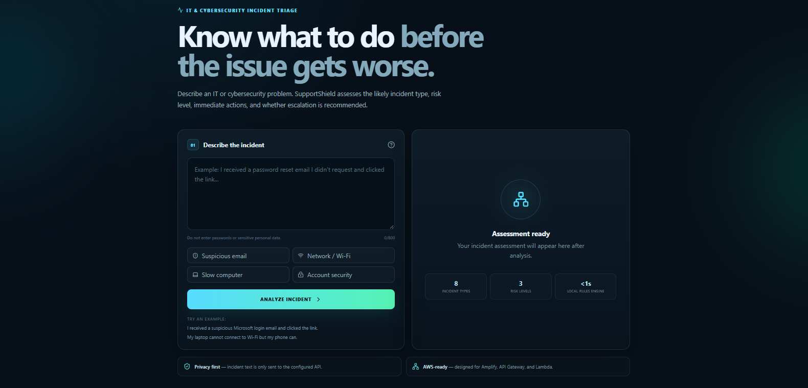
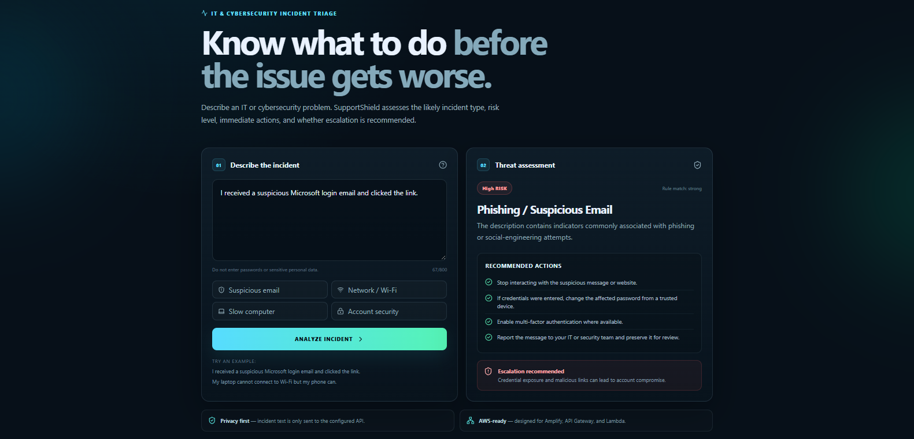
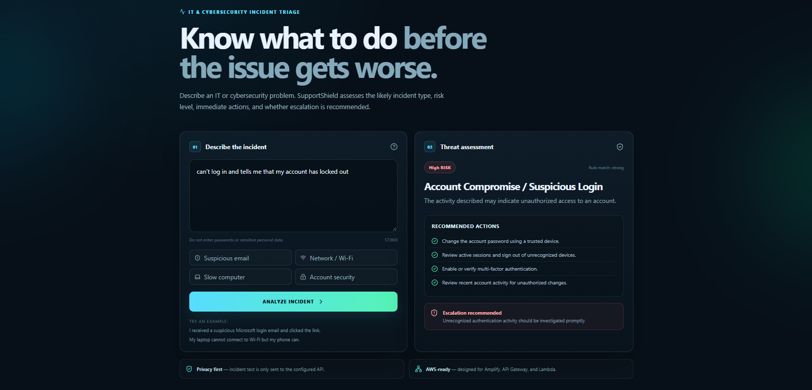
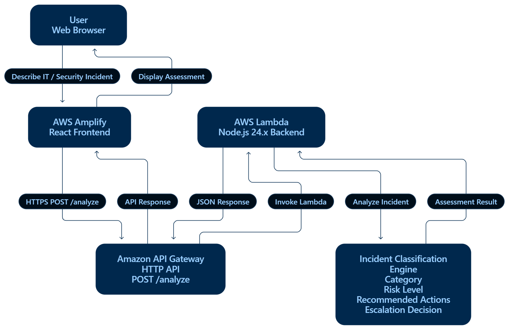
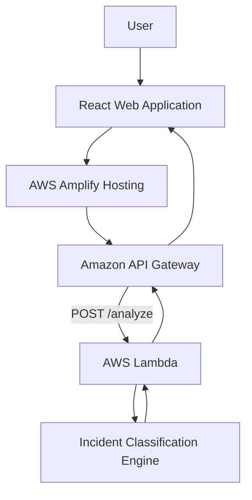

# SupportShield

**IT & Cybersecurity Incident Triage Assistant**

SupportShield is a serverless web application designed to help users quickly assess common IT and cybersecurity incidents.

A user describes a problem they are experiencing, and SupportShield analyzes the description to provide:

- An incident category
- A risk level
- Recommended immediate actions
- An escalation recommendation
- Guidance on when an IT or cybersecurity professional should be contacted

SupportShield is designed as a first-response triage tool for common technical and security problems.

---

## Live Application

**Live Demo:** https://main.d11agh47utcj1i.amplifyapp.com

## Screenshots

### Main Interface



### Phishing Analysis



### Account Security Analysis



The frontend will be hosted using **AWS Amplify**.

---

## What SupportShield Does

Users can describe an IT or cybersecurity issue in plain language.

For example:

```text
I received a suspicious Microsoft login email and clicked the link.
```

SupportShield analyzes the description and can return an assessment such as:

```text
Category: Phishing / Suspicious Email

Risk Level: HIGH

Escalation: Recommended
```

It then provides recommended actions such as:

- Stop interacting with the suspicious website or message
- Change potentially exposed credentials
- Enable multi-factor authentication
- Preserve the suspicious message for investigation
- Notify the appropriate IT or security team

---

## Supported Incident Categories

The current version of SupportShield can identify and respond to several common IT and cybersecurity scenarios:

- Phishing and suspicious emails
- Malware and suspicious downloads
- Password and account compromise
- Suspicious login activity
- Wi-Fi and network connectivity issues
- Slow computer or performance problems
- Software and application problems
- Hardware and device problems

Each category has its own risk assessment, recommended actions, and escalation guidance.

---

## Risk Assessment

SupportShield classifies incidents using three primary risk levels:

### Low

Routine technical issues that can usually be resolved through standard troubleshooting.

### Medium

Issues that may require additional investigation or assistance from IT support.

### High

Potential cybersecurity incidents where credentials, systems, devices, or organizational data may be at risk.

---

## Architecture



SupportShield uses a serverless AWS architecture.



### Request Flow

```text
User
  |
  v
SupportShield React UI
  |
  | POST /analyze
  v
Amazon API Gateway
  |
  v
AWS Lambda
  |
  v
Incident Classification Engine
  |
  v
Risk Assessment + Recommended Actions
  |
  v
SupportShield UI
```

---

## AWS Services

### AWS Amplify

AWS Amplify hosts and deploys the SupportShield React frontend.

The application is connected to GitHub so future code updates can automatically trigger new deployments.

### Amazon API Gateway

API Gateway provides the public HTTP endpoint used by the frontend.

SupportShield sends incident descriptions to:

```text
POST /analyze
```

API Gateway then forwards the request to the Lambda backend.

### AWS Lambda

AWS Lambda contains the incident analysis logic.

The Lambda function receives the incident description, evaluates it against the classification rules, and returns a structured JSON response containing:

- Category
- Risk level
- Confidence
- Summary
- Recommended actions
- Escalation status
- Escalation reason

---

## Example API Response

An incident assessment may return data similar to:

```json
{
  "category": "Phishing / Suspicious Email",
  "risk": "High",
  "confidence": "strong",
  "escalation": true,
  "summary": "The description contains indicators commonly associated with phishing or social-engineering attempts.",
  "actions": [
    "Stop interacting with the suspicious message or website.",
    "If credentials were entered, change the affected password from a trusted device.",
    "Enable multi-factor authentication where available.",
    "Report the message to your IT or security team and preserve it for review."
  ],
  "escalationReason": "Credential exposure and malicious links can lead to account compromise."
}
```

---

## Technology Stack

### Frontend

- React
- Vite
- JavaScript
- HTML
- CSS

### Backend

- Node.js
- AWS Lambda

### Cloud Infrastructure

- AWS Amplify
- Amazon API Gateway
- AWS Lambda

### Development & Deployment

- Git
- GitHub
- GitHub-to-Amplify deployment workflow

---

## Project Structure

```text
supportshield/
│
├── frontend/
│   ├── src/
│   ├── index.html
│   └── package.json
│
├── lambda/
│   └── incident-analyzer/
│       └── index.mjs
│
├── tests/
│   └── lambda-test.mjs
│
├── docs/
│
├── screenshots/
│
├── amplify.yml
│
└── README.md
```

---

## Running the Frontend Locally

Navigate to the frontend directory:

```bash
cd frontend
```

Install the required packages:

```bash
npm install
```

Start the development server:

```bash
npm run dev
```

Vite will provide a local development URL that can be opened in a browser.

---

## Running the Backend Tests

The Lambda classification engine includes lightweight automated tests.

Run:

```bash
node tests/lambda-test.mjs
```

The tests validate key incident scenarios including:

- Phishing
- Malware
- Account compromise
- Network troubleshooting

---

## How the Classification Engine Works

The current SupportShield MVP uses a deterministic rule-based classification system.

The Lambda function evaluates words and indicators contained in the user's incident description and compares them against known incident categories.

For example, terms related to:

```text
suspicious email
clicked link
login email
password reset
attachment
```

may indicate a phishing or social-engineering incident.

The engine then determines the appropriate:

```text
Incident category
        +
Risk level
        +
Recommended response
        +
Escalation guidance
```

Using deterministic rules keeps the first version of SupportShield:

- Fast
- Predictable
- Low-cost
- Easy to deploy
- Independent of external AI model availability

Future versions could introduce AI-assisted incident analysis using services such as Amazon Bedrock.

---

## Security and Privacy

SupportShield is a demonstration and educational incident-triage application.

Users should **not enter**:

- Passwords
- Authentication codes
- API keys
- Access tokens
- Private encryption keys
- Confidential company information
- Personally identifiable information that is not necessary for troubleshooting

SupportShield provides first-response guidance and is **not a replacement for an organization's IT department, SOC, cybersecurity team, or incident-response procedures**.

High-risk cybersecurity incidents should always be escalated to the appropriate professionals.

---

## Future Improvements

Potential future versions of SupportShield could include:

- Amazon Bedrock-powered incident analysis
- More advanced threat classification
- Incident history
- Authentication
- DynamoDB storage
- Administrator dashboards
- Security analytics
- SIEM integration
- Automatic incident reports
- CVE and vulnerability information
- CloudWatch monitoring
- Multi-language support

---

## AWS Weekend Deployment Challenge

SupportShield was initially created for the **AWS Weekend Deployment Challenge**.

The goal of the project is not only to deploy an application on AWS, but also to demonstrate a practical serverless architecture combining a modern frontend, HTTP API, and Lambda-based backend.

**Challenge article title:**

```text
Weekend Deployment Challenge: SupportShield
```

**Tag:**

```text
#deployment
```

---

## Disclaimer

SupportShield provides general IT and cybersecurity guidance for educational and demonstration purposes.

Security incidents involving compromised credentials, malware, unauthorized access, sensitive information, or organizational systems should be handled according to the relevant organization's official security and incident-response policies.
